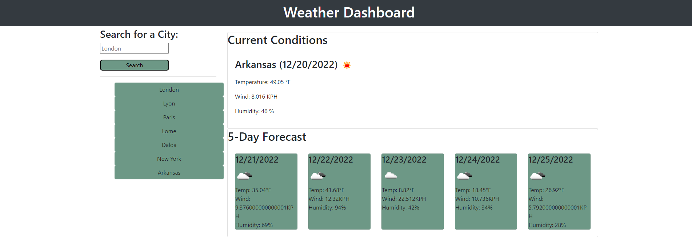

# Weather-Dashboard

## Description
Creation of a web app that allows users to see the weather forecast for cities of their choosing.

## Contents
* User Story
* Acceptance Criteria
* Screenshot
* Contributors
* Deployment
* Technologies
* Usage
* Documentation
* License

 

## User Story
<pre>
    AS A traveler
    I WANT to see the weather outlook for multiplies cities
    SO THAT I can plan a trip accordingly
</pre>

## Acceptance Criteria
* Create a weather dashboard with form inputs.
* When a user searches for a city they are presented with current and future conditions for that city and that city is added to the search history.
* When a user vies the current weather conditions for that city they are presented with:
    * The city name
    * The date
    * An icon representation of weather conditions
    * The temperature
    * The humidity
    * The wind speed
* When a user views future weather conditions for that city they are represented with a 5-day forecast:
    * The date
    * An icon representation of weather conditions
    * The temperature
    * The humidity
* When a user clicks on a city in the search history they are again presented with current and future conditions for that city.
 
 

## Screenshot

 
 

## Contributors
* Adam Sall - <a href="https://github.com/Kaiyfa">@Kaiyfa</a>
* Chris-Eric Dagbo - <a href="https://github.com/cedagbo">@cedagbo</a>
* Vittoria Bugana - <a href="https://github.com/vbugana">@vbugana</a>

 

## Deployment
* 👉 Website → 
* 👉 Repository → <a href="https://github.com/cedagbo/Weather-Dashboard"> GitHub Repository </a>
 

## Usage

 

## Technologies

 

 

##

## Documentation

 

## License
MIT License